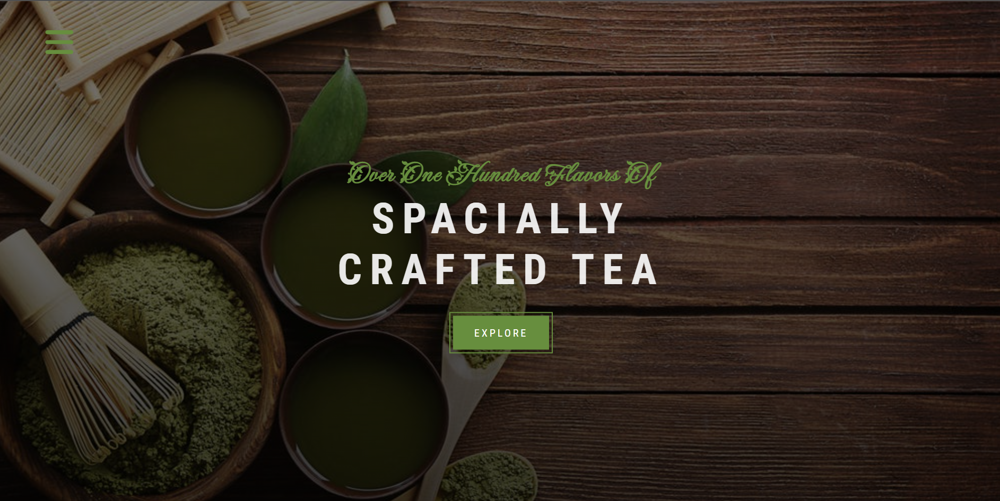

# Tea Station
## _Practice project with CSS Floats_

Tea Station is a website created for learning purposes. Whit the use of HTML5, CSS3, and a bit of JavaScript, this responsive website is:

- smooth scrolling,
- mobile-friendly,
- server-side hosted icons,
- ready to receive emails (integrated Formspree).

## Reviewing you can exercise:

- HTML5 tangs and CSS3 selectors,
- creating a responsive website using CSS floats,
- linking external: styles, scripts, fonts,
- creating multiple HTML pages and navigating between them,
- creating animation,
- server-side hosting of icons (Font Awesome),
- connecting for receiving emails (Formspree).

## Why FLoats?
You can still find code still written or depends on CSS. So it's good to be familiar with it.

## Built from source:

[HTML&CSS Tutorial and Projects Course 2022 (Flexbox&Grid)](https://www.udemy.com/course/in-depth-html-css-course-build-responsive-websites/)
